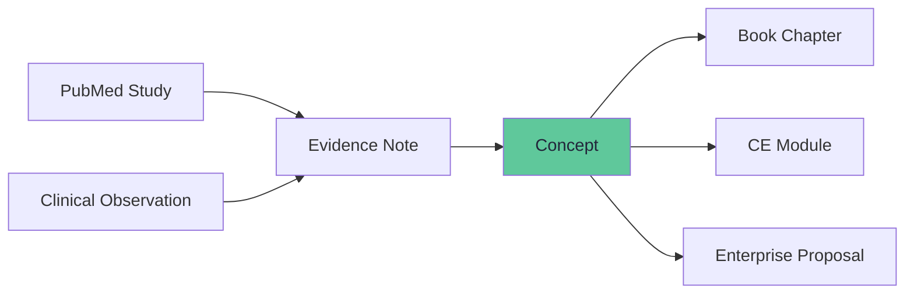
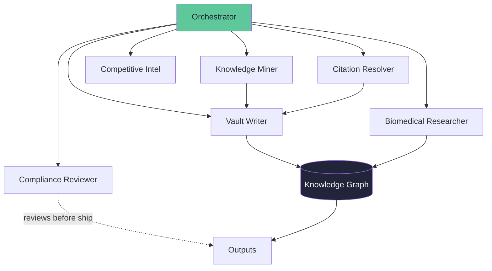
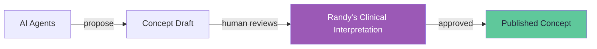
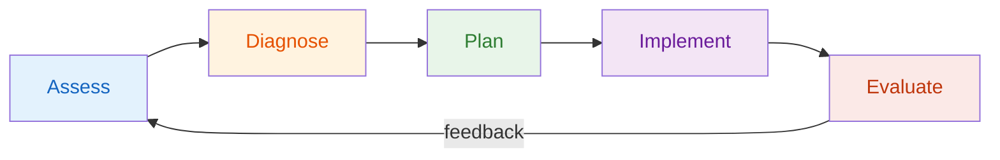

# LinkedIn Post: How a CRNA Built an AI Knowledge System

**Audience:** Nursing leaders, CNOs, nursing informatics, innovation officers — just back from HIMSS 2026
**Tone:** Builder showing work. Peer-level. Not vendor. Entice for consulting without pitching.
**Length:** ~700 words

---

## POST

**I built an AI research system as a CRNA. No engineering team. Here's how.**

Years ago at Rush, I snuck into the math library at UIC to learn Bayes' theorem for a nursing theory paper. My colleagues were building the humanistic foundation I still rely on. I wandered into the math library and found another wing of the same building.

That instinct — cross-domain integration from inside nursing — is what I want to show you. After HIMSS, every nursing leader is asking how AI fits. Most answers come from vendors. Here's one from a clinician.

**Step 1: Organize what you know.**
I built a knowledge graph — not folders, a graph. Every clinical concept links to the evidence that supports it and the source it came from. When I make a claim, the system shows the chain.

**Step 2: Teach AI agents your domain.**
I configured specialized AI agents — each one does one job.

**Step 3: Protect the human gate.**
Every concept has a field only the clinician fills. The AI proposes. I decide.

**Step 4: Run it on ADPIE.**
The whole system operates on the nursing process — not as metaphor, as operating logic.

**Step 5: Let it compound.**
In 72 hours, this system produced 9 book chapter drafts, 7 research essays, 2 enterprise proposals, and a competitive analysis across 35 companies. One clinician. No engineering team.

**The point isn't the system. It's the method.**

The clinical knowledge your teams carry is your most underleveraged asset. Every nurse who retires takes decades of pattern recognition. Every burned-out clinician who leaves takes wisdom that was never captured.

What if you could capture it, organize it, and make it teachable — governed by the same ADPIE process you already trust?

Organizations like SONSIEL and leaders like Rebecca Love have been building the infrastructure for nurse-led innovation. Programs at Rush, VCU, and UW Nursing are training the next generation. This is one CRNA building on that foundation with AI.

If this resonates — I'd welcome the conversation.

Building in public. Showing the work. Support innovation in nursing.

🔗 sonsiel.org

---

*Randy Graybeal, CRNA — Co-founder, Somnistics Research Labs. 28 years in the OR. Building at the intersection of clinical expertise, AI, and nervous system science.*

---

## HASHTAGS

#NursingLeadership #NursingInformatics #HIMSS26 #AgenticAI #ClinicalInnovation #KnowledgeManagement #HealthcareAI #NurseInnovation #ClinicianWellbeing #BuildInPublic #SONSIEL #NurseEntrepreneur #NurseHackathon #NursingIsSTEM #NurseApproved #NurseInnovator #HealthTechInnovation #VentureMechanics #StartupFounder #NurseScientist #DigitalHealth #NurseLed

## TAG / MENTION

- **Rebecca Love, RN, MSN, FIEL** — @rebeccalovenursing — SONSIEL President Emerita, first nurse on TED.com, LinkedIn Top Voice, Forbes Business Council, Co-Chair NursingIsSTEM Coalition, founded Commission for Nurse Reimbursement. She IS the nurse innovation movement. Her audience is exactly who this post is for.
- **SONSIEL** — @sonsiel — Society of Nurse Scientists, Innovators, Entrepreneurs & Leaders. UN affiliate. NurseHack4Health. The professional home for nurse innovators.
- **Michael Thorn** — SRL advisor, SONSIEL board, Mayo Clinic trauma NP. Warm connection validates SRL within the SONSIEL network.
- **Ron Wiener** — @ronwiener — Venture Mechanics, Seattle startup ecosystem. Randy's fundraising advisor. Tagging signals that this is a real company with real mentorship, not a side project.
- **Venture Mechanics** — @venturemechanics — Seattle incubator/accelerator. Social proof for the startup community.

## ACADEMIC PROGRAMS TO TAG

- **Rush University CRNA Program** — @Rush University College of Nursing — Top-tier CRNA program in Chicago. Tagging signals that this work is relevant to the pipeline, not just practicing CRNAs. Rush faculty and students see this as innovation coming from inside their profession.
- **VCU CRNA Program** — @Virginia Commonwealth University Department of Nurse Anesthesia — Active SRL pilot site discussion. Tagging makes the relationship visible without overstating it. VCU faculty who see this may reach out to the program leadership who already know Randy.
- **University of Washington School of Nursing** — @UW School of Nursing — Randy's home region (Pacific Northwest / Somnistics HQ). UW Nursing has strong informatics and innovation programs. Local academic credibility. Connection to the Seattle startup ecosystem via Venture Mechanics.

## TAGGING STRATEGY

**In the post body (natural mentions, not hashtag dumps):**
"Organizations like @SONSIEL and leaders like @Rebecca Love have been building the infrastructure for nurse-led innovation for years. Programs at @Rush University, @VCU Nurse Anesthesia, and @UW Nursing are training the next generation. What I'm sharing is one CRNA's attempt to build on that foundation with AI."

**In comments (after posting):**
Tag Ron Wiener, Venture Mechanics, and Michael Thorn in a first comment: "Built with mentorship from @Ron Wiener at @Venture Mechanics and clinical guidance from @Michael Thorn. Standing on shoulders."

This separates the organic mentions (in-post) from the network activation (comments) — LinkedIn's algorithm rewards comment engagement, and tagging in comments notifies without cluttering the post.

## NOTES FOR RANDY

- This does NOT mention Pausality, the app, or any product — it's about the METHOD
- "Building in public" positioning invites conversation without selling
- The three surprises are genuine insights, not marketing: embodied knowledge as data, AI as amplifier with provenance, ADPIE applied to knowledge
- The CTA is "I'd welcome the conversation" — consulting language without using the word
- No trade secrets revealed: doesn't mention specific bot names, MCP architecture, vault file structure, or proprietary concepts
- What's shared: the APPROACH (knowledge graph, AI agents, ADPIE, provenance tracking) — which is replicable and positions Randy as the guide
- What's withheld: the CONTENT (146 specific concepts, trademarked protocols, patent architecture, competitive intelligence) — which is the IP
- The implicit offer: "I know how to do this. You don't. Let's talk."
- Gertrude-compliant: no medical device claims, no outcome promises, no biofeedback terminology
