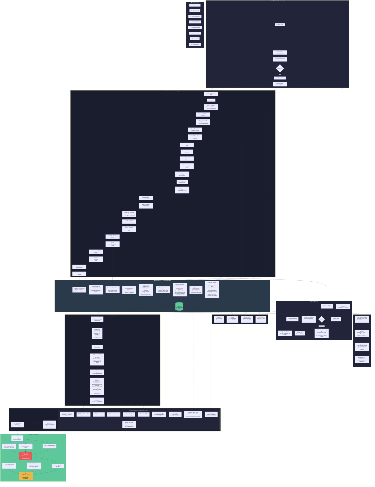

# Session Flow — March 18-21, 2026

```mermaid
flowchart TD
    subgraph INIT["🌅 SESSION START — March 18"]
        A[Overnight Update] --> B[6 untracked vault architecture files]
        B --> C[Commit Vault Architecture v2]
        C --> D{Obsidian CLI?}
        D -->|Install| E[CLI v1.12.4 registered]
        E --> F[Tool Routing Table → CLAUDE.md]
    end

    subgraph MINING["⛏️ CHATGPT MINING — 861 files, 60+ processed"]
        F --> G[Randy: Springett not in vault]
        G --> H[26 files found]
        H --> I["Wave 1: Springett + Developmental Psychology\n9 files, 5 parallel agents"]

        I --> J[Randy: Book stacks + consiliences]
        J --> K["Wave 2: Book Stack Synthesis\n5 files, 3 parallel agents"]

        K --> L[Randy: Personality, intelligence, attention]
        L --> M["Wave 3: Personality + Intelligence\n4 files, 462K"]

        M --> N[Randy: Learning how to learn]
        N --> O["Wave 4: Meta-Learning\n7 files, 199K"]

        O --> P[Randy: Positive psychology, UC PMHNP]
        P --> Q["Wave 5: Positive Psychology\n8 files"]

        Q --> R["💡 Randy: Use information science\nnot my memory"]
        R --> S["TF-IDF Gap Analysis\nCorpus vs Vault"]
        S --> T[Priority Queue: 50 ranked files\noutputs/mining-priority-queue.md]

        T --> U[Randy: Embodied metacognition + Waking Up]
        U --> V["Wave 6: Embodied Metacognition\n5 files"]

        V --> W["Wave 7: Red Arrow Gap Files\n3 files, highest Randy signal"]

        W --> X[Randy: Binaural + coherence + visualization]
        X --> Y["Wave 8: Coherence Protocols\n6 files"]

        Y --> Z[Randy: EEG, Muse, Mind Monitor]
        Z --> AA["Wave 9: EEG/Neurofeedback\n7 files"]

        AA --> AB[Randy: Huberman, Siegel, Gervais]
        AB --> AC["Wave 10: Influences + Expertise\n8 files"]

        AC --> AD[Randy: Cognitive development arc]
        AD --> AE["Wave 11: Cognitive Arc Mining"]
    end

    subgraph VAULTWRITE["✍️ VAULT WRITES — 90+ concepts created"]
        I --> VW1["8 concepts: Stairway Protocol\nSecure Attachment to Reality\nAgency-Consciousness Integration\nAgentic Time Weaving\nTime-Between-Worlds Gap Minute\nGap Moment Codex\nConsilience-by-Translation\nNon-Ergodic Risk"]

        K --> VW2["5 concepts: Consilience\nIdeas Having Sex\nSyntopical Synthesis\nResonant Nonfiction\nNon-Ergodic Risk Clinical"]

        M --> VW3["7 concepts: Attention as Gain Control\nMAIA-2-CRNA\nEmbodied Clinical Intelligence\nBenner Expertise Spiral\nTacit Knowledge Extraction\nState Transition Intelligence\nLearning Under Load"]

        Q --> VW4["3 concepts: Awe as Regulation\nCuriosity as Clinical Stance\nHormesis-Durability Model"]

        V --> VW5["5 concepts: Embodied Metacognition ★\nNondual Clinical Awareness\nContemplative Progressive Overload\nCardiac-Anchored Breathing\nLayered Intervention Stack"]

        Y --> VW6["3 concepts: Neuro-Respiratory Cardiac Coherence\nAutonomic Home Base\nAdversity Visualization"]

        AA --> VW7["3 concepts: Vitarka-Vicara Integration\nAlpha-Theta Crossover\nDMN Voluntary Control"]

        AC --> VW8["4 concepts: State Drift\nInteroceptive Suppression Hypothesis\nStructured Interoception Training\nNeuroHike"]

        AE --> VW9["Cognitive Development Arc\n6 phase observations\nCognitive Breathing Pattern"]

        VW1 & VW2 & VW3 & VW4 & VW5 & VW6 & VW7 & VW8 & VW9 --> VAULT[(146 Concepts\n238 Evidence\n205 Observations\n150+ SKOS Links)]
    end

    subgraph INFRA["🔧 INFRASTRUCTURE"]
        F --> MCP_FIX[Fix MCP update_note permission\n7 tools added to allowlist]
        T --> PIPELINE["Automated Pipeline\ntools/mine-next-batch.sh"]
        PIPELINE --> PIPELINE_TEST{Test run?}
        PIPELINE_TEST -->|claude -p works| PIPELINE_PROVEN["✅ First autonomous mining run\ncognitive-emotional-state-interface.md\n21 files created by pipeline alone"]
        PIPELINE --> LAUNCHD["launchd config\nNightly 2 AM runs"]

        VAULT --> CITATION["Citation Health Monitor\ntools/check-citations.sh"]
        CITATION --> BASELINE["Baseline: 45%\n100 valid | 70 broken | 52 missing"]
        CITATION --> CITATION_CRON["Monthly cron\n1st of month, 3 AM"]

        VAULT --> EVIDENCE_TOOL["Evidence Brief Generator\ntools/evidence-brief.sh\nOne command → branded HTML"]
    end

    subgraph BIOMEDICAL["🔬 BIOMEDICAL VALIDATION"]
        VAULT --> BV1["Layer 1: Surface Sweep\n44 concepts × 8 clusters\n4 parallel agents"]
        BV1 --> BV1_RESULT["Cluster results:\nAutonomic 7/10\nInteroception 7/10\nBreathwork 7/10\nEEG 6/10\nClinical 7/10\nContemplative 5/10"]

        BV1_RESULT --> BV2["Layer 2: Deep Dives\n3 parallel agents"]
        BV2 --> BV2_RESULT["PVT: reframe to NVI\nCardiac-anchored: 1 study, first-mover\nISH: zero competitors\nBinaural: 5/14 studies\nHormesis: adopt SIT instead\nMicro-dose: 5-min floor"]

        BV2_RESULT --> BV3["Layer 3: Mechanism Queries\n12 BioMistral queries direct"]
        BV3 --> BV3_RESULT["ISH neural pathway: insula-ACC-PFC\nReappraisal paradox: BREATH FIRST\nNeuroplasticity: 30min/day minimum\nCRNA burnout: 68% / 22% PTSD\nNVI model: testable predictions\nTeam co-regulation: measured in OR"]

        BV3_RESULT --> EVIDENCE_REPORT["Scientific Evidence Assessment\n621 lines, 106 PubMed refs\n3 costed study designs"]
    end

    subgraph OUTPUTS["📄 DELIVERABLES — 9 evidence briefs + 4 GUIs"]
        EVIDENCE_REPORT --> GUI_ASSESSMENT["Evidence Assessment GUI\nDark mode → BioMistral callouts"]

        VAULT --> GUI_GRAPH["Vault Graph\nD3.js, 146 nodes\ninteractive force-directed"]

        VAULT --> NURSING_THEORY["Somnistics Nursing Theory\nMiddle-range, 13 hypotheses\nExtends Benner/Roy/Watson/Parse/Nightingale"]

        EVIDENCE_REPORT --> EB_GMT["GMT 21-Day Evidence Brief\nSurgeon-readable"]
        EVIDENCE_REPORT --> EB_SRNA["SRNA User Journey\n16 outcomes mapped"]
        EVIDENCE_REPORT --> EB_ECON["CRNA Career Economics\n$3.9M at stake, 540x ROI"]
        EVIDENCE_REPORT --> EB_CERT["Certification Dual-Track\nCRNA × Motorsport"]
        EVIDENCE_REPORT --> EB_SKILLS["Certification Skills\n7 ranked, MUSC style"]
        EVIDENCE_REPORT --> EB_RESILIENCE["Resilience Landscape\n14 world-class programs mapped"]

        EB_CERT --> EB_MISSIMO["Missimo One-Pager\n3 cards, zero jargon\n'Train your nervous system\nlike you train your car'"]

        VAULT --> HONEYCUTT["Honeycutt Email\nResearch collaboration\n3 study designs attached"]
    end

    subgraph COMPETITIVE["🔍 COMPETITIVE INTELLIGENCE"]
        VAULT --> COMP_EIGHTOS["EightOS\nFractal breathing\nDFA alpha metric\nZero citations"]
        VAULT --> COMP_JHOURNEY["Jhourney\n$4K jhana retreats\n40hrs vs SRL's 63min\nAdverse event reports"]
        VAULT --> COMP_40YOZ["40 Years of Zen\n$16K neurofeedback\n19-electrode qEEG\nZero published studies"]
        VAULT --> COMP_AMEN["Amen Clinics\n200K SPECT scans\nAPA criticism\n$3.5-8K evaluations"]
    end

    subgraph NEUROTAGGING["🏷️ NEUROTAGGING DEEP DIVE"]
        VAULT --> NT_STANDARDS["7 Data Standards Mapped\nBIDS, NWB, CDISC, FHIR\nIEEE 1752, Open mHealth, DHT"]
        NT_STANDARDS --> NT_GAP["THE GAP:\nIntervention ↔ Target ↔ Outcome\nNOBODY HAS BUILT IT"]
        NT_GAP --> NT_BRIDGES["3 Bridge Frameworks\nGrawe Neuropsychotherapy\nBarrett EPIC Model\nStephan Computational Psychiatry"]
        NT_BRIDGES --> NT_POSITION["Neurotagging = 10 evidence links\nThe BIDS for behavioral interventions"]
    end

    subgraph SOCIAL["📱 SOCIAL + NEWSPAPER"]
        EB_ECON --> FB_POST["Facebook Post\n28K CRNAs\n'Your nervous system is a\n$6M asset with no\nmaintenance protocol'"]

        OUTPUTS --> NEWSPAPER["The Pausality Times\nVol. 1, Issue 1\n9 stories, editorial by Vigil"]
    end

    subgraph FEEDBACK["⚡ THE CUT — March 21"]
        NEWSPAPER --> FEEDBACK_IN["External feedback:\n'You're building a map.\nYou need a weapon.'"]

        FEEDBACK_IN --> TRUTH1["Truth 1: Breathwork alone\nis economically worthless\n$7.7M raised → $2.2M exit"]
        FEEDBACK_IN --> TRUTH2["Truth 2: No one owns\nthe clinician nervous system"]
        FEEDBACK_IN --> TRUTH3["Truth 3: Intelligence without\naction is accurate and inert"]

        TRUTH1 & TRUTH2 & TRUTH3 --> THE_TEST["THE 14-DAY TEST\n10 CRNAs\nDaily 60-second protocol\nSee HRV change\nInvite 1 other CRNA"]

        THE_TEST --> ACTION1["Action 1: Get 10 names\nFacebook post = recruitment"]
        THE_TEST --> ACTION2["Action 2: Certification as\ninfrastructure, not content\nSignup page + Stripe + cohort date"]
        THE_TEST --> ACTION3["Action 3: Drop the post\nthis week"]

        ACTION1 & ACTION2 & ACTION3 --> TILT["TILT:\nIntelligence → Action\nMap → Weapon\nUnderstanding → Propagation"]
    end

    subgraph STATS["📊 SESSION STATS"]
        direction LR
        S1["54 → 146+ concepts"]
        S2["3 → 60+ files mined"]
        S3["0 → 12 BioMistral queries"]
        S4["0 → 9 evidence briefs"]
        S5["0 → 4 competitive analyses"]
        S6["0 → 7 validation reports"]
        S7["40+ git commits"]
        S8["~30 hours continuous"]
    end

    style INIT fill:#22253A,color:#F5F5F0
    style MINING fill:#1A1D2E,color:#F5F5F0
    style VAULTWRITE fill:#2a3a4a,color:#F5F5F0
    style INFRA fill:#22253A,color:#F5F5F0
    style BIOMEDICAL fill:#1A1D2E,color:#F5F5F0
    style OUTPUTS fill:#22253A,color:#F5F5F0
    style COMPETITIVE fill:#1A1D2E,color:#F5F5F0
    style NEUROTAGGING fill:#22253A,color:#F5F5F0
    style SOCIAL fill:#1A1D2E,color:#F5F5F0
    style FEEDBACK fill:#5FC89B,color:#22253A
    style STATS fill:#22253A,color:#5FC89B
    style VAULT fill:#5FC89B,color:#22253A,stroke:#5FC89B,stroke-width:3px
    style TILT fill:#E8B84A,color:#22253A,stroke:#E8B84A,stroke-width:3px
    style THE_TEST fill:#E85A5A,color:#F5F5F0,stroke:#E85A5A,stroke-width:3px
```
