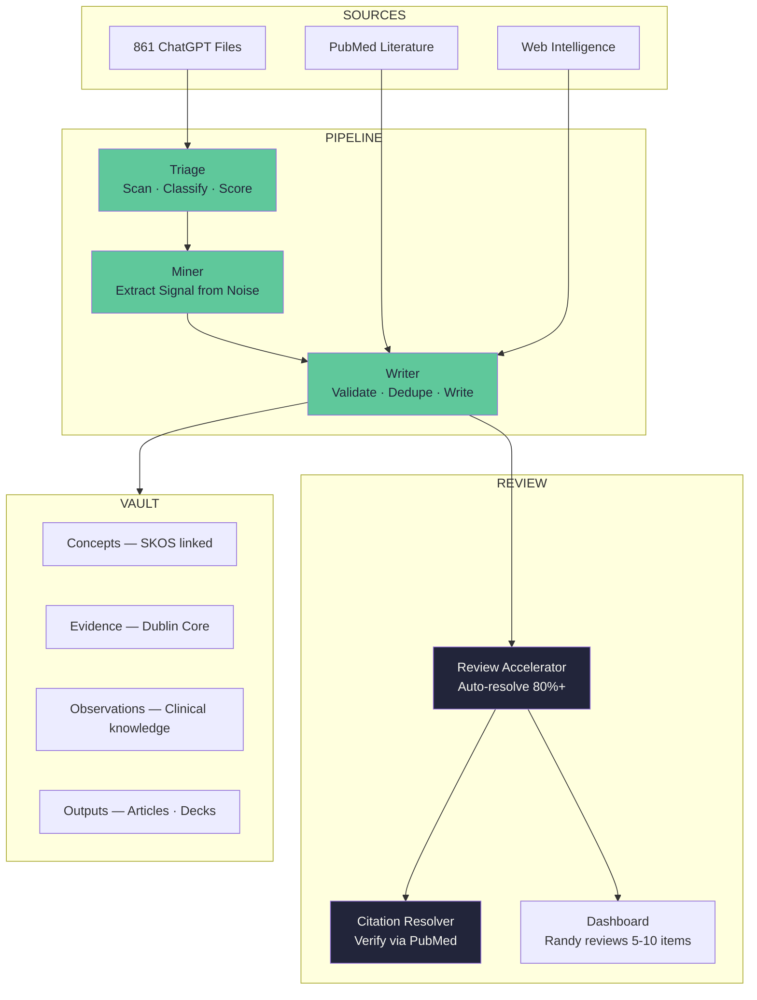

# I Built a Self-Improving Knowledge System in 48 Hours. Here's Exactly How.

*A CRNA's weekend with Claude, Obsidian, and 861 unprocessed conversations.*

---

In 2019, I asked myself a question I couldn't answer: *Is my heart rate higher or lower than my patients'?*

I'm a nurse anesthetist. Twenty-eight years in operating rooms — transplant, pediatric trauma, cardiac. I spend my days monitoring other people's vital signs with obsessive precision. I calculate pediatric drug doses where the decimal moves two places between adults and children — knowing that the number one medication error in hospitals is a decimal error. I think about how not to stab yourself with a bloody needle at 3 AM on a call shift. I manage other people's nervous systems for a living. But I'd never once turned that attention on my own.

My ankles were hurting when I got out of bed. So I started doing yoga on the Peloton app — no knowledge at all, just following along. I did a thousand classes. And somewhere in those thousand classes, something shifted. Each class has hundreds of expert cues — "pull your left hip forward," "soften your front ribs," "root through your big toe mound." Thousands of cues across thousands of classes. What I didn't realize at the time was that those cues were building an interoceptive map — a felt-sense atlas of my own body, created by the shapes the asanas demand.

Then I learned about pratyahara — the yogic practice of sense withdrawal, breathing layered on top of the physical postures. Oh. That was life-changing. The body becomes a landscape you can navigate from the inside.

That was five years ago. Since then I've been looking intensely at integral performance techniques for call shifts. How to think well under pressure. How to sustain clinical precision across a 28-year career without the progressive erosion of judgment, empathy, and vigilance that we euphemistically call "burnout." I built a company around what I found — Somnistics Research Labs — and a product called Pausality: 60-second breathing protocols with real-time Apple Watch biofeedback. Not meditation. Nervous system training.

Over six months of building, I accumulated 861 ChatGPT conversations. Every strategic decision, clinical insight, novel concept, and research thread — trapped in chat transcripts. Meanwhile, I had a knowledge graph in Obsidian with 180+ linked notes covering our science and evidence. But the two systems weren't talking to each other, and the graph wasn't growing on its own.

This weekend, I sat down with Claude and built something that changed how I work.

---

## What I Built

A system called **Vigil** — named for the watchfulness that defines anesthesia practice.

Vigil is an AI orchestrator that manages six specialized bots. Each bot has its own identity, skills, execution protocol, and self-improvement mechanism. None of them are code. They're markdown files that Claude reads and follows.

Here's the architecture:

---

## The Six Bots

**1. Transcript Triage** scans all 861 files, classifies them by category (clinical, strategy, product, framework), scores extraction value, and produces a prioritized queue. It learns which file patterns are high-value and which are noise.

**2. Knowledge Miner** reads each transcript and extracts *only my original thinking* — not the AI's elaboration. When I say something in 2 sentences and ChatGPT expands it to 10 paragraphs, the 2 sentences are the knowledge. The miner learns to recognize my voice patterns over time.

**3. Vault Writer** validates every extraction against metadata standards (Dublin Core for sources, SKOS for concept relationships, PROV-O for provenance chains), checks for duplicates, and writes to the knowledge graph through an MCP server. Nothing enters the vault without passing its quality gates.

**4. Review Accelerator** sits between the pipeline and me. It auto-resolves everything it can — citation lookups, schema fixes, obvious non-duplicates — and pre-drafts recommendations for the rest. I review 5-10 items instead of 50. It learns from my decisions: after I approve the same type of item 3 times, it handles that type autonomously.

**5. Citation Resolver** takes every study mentioned in the vault and verifies it against PubMed. Real PMID. Real DOI. Real findings. If the citation can't be verified, it gets flagged — never fabricated. This weekend it caught 3 citation errors before they went into investor-facing materials.

**6. Extraction Coordinator** manages the pipeline end-to-end. It runs retrospectives after every batch, tracks system health across all bots, and ensures the whole system can stop and resume across sessions.

---

## The Self-Improvement Loops

This is the part that surprised me.

Each bot runs a mandatory retrospective after every batch — structured self-reflection about what worked, what didn't, and what to change. Those reflections feed into pattern libraries that get loaded on the next run. The vault writer sends feedback to the knowledge miner about which extractions were accepted and which were rejected. The coordinator tracks system-level trends.

The result: batch 1 is rough. Batch 5 is noticeably better. By batch 10, the bots handle 85% of the work autonomously. My review queue shrinks every cycle.

Three feedback loops, drawn from the research literature on self-improving AI agents:

- **Reflexion** — verbal self-reflection stored as episodic memory (Shinn et al., 2023)
- **Pattern libraries** — accumulated heuristics that compound across runs
- **Cross-bot feedback** — the evaluator-optimizer pattern (Anthropic, 2024)

---

## What 48 Hours Produced

| Metric | Count |
|--------|-------|
| New vault notes | 59 |
| Graph edges wired | 155 |
| PubMed studies ingested | 46 |
| Citations verified against PubMed | 12/12 |
| Citation errors caught | 3 |
| Bot protocol files | 42 |
| Contact tracker entries | 58 |
| Peer-reviewed articles sourced this month | 4 |

---

## The Test

On Saturday afternoon, the founder of Audible emailed my co-founder with three pointed questions about our product: What does it actually do? Why is the market so small? Why not just take beta blockers?

I pointed Vigil at the knowledge graph. It queried our evidence base, ran a same-day PubMed scan, and verified every claim against the actual studies. Three of the studies in my response were published that same month — including a Nature paper that coined a term for the exact category of intervention we're building.

The response was drafted in hours. Every claim sourced. Every citation verified by PMID. From a living knowledge base, not from memory.

---

## How I Actually Built It

No code. No engineering degree. Here's what it took:

**The foundation:**
- An Obsidian vault with YAML frontmatter on every note
- Three metadata standards: Dublin Core (sources), SKOS (concept links), PROV-O (provenance)
- A Python MCP server (360 lines) that lets Claude read and write to the vault

**The bots:**
- 42 markdown files organized in `_bots/` — each bot has a `soul.md` (identity), `skills.md` (capabilities), `run-protocol.md` (execution steps), `retrospective.md` (self-improvement), `patterns.md` (accumulated heuristics), and `learning-log.md` (quality tracking)
- No code in any of them. They're prompts that Claude reads and follows.

**The workflow:**
- I say: "Run the extraction coordinator on the next 10 files."
- Claude reads the bot's soul and protocol, loads its pattern library, processes the batch, writes to the vault, runs the review accelerator, and presents me with a dashboard.
- I approve or edit 5-10 items. My decisions feed back into the system.
- The vault grows. The bots improve. I go to sleep.

---

## What This Means

I'm a clinician, not an engineer. I built this because I needed it — 28 years of clinical knowledge and 6 months of research were scattered across chat transcripts, and I needed a system that could organize, verify, and grow that knowledge autonomously.

What I learned: the AI isn't the product. The *architecture* is the product. The standards, the metadata, the provenance chains, the feedback loops — that's what makes the system trustworthy. Without verified citations, it's just a chatbot with opinions. With them, it's a knowledge system that earns credibility every time it's queried.

The vault is no longer something I build. It builds itself. I curate.

---

*Randy Graybeal is a CRNA with 28 years of clinical experience and co-founder of Somnistics Research Labs, where he builds nervous system training tools for high-stakes professionals. The system described in this post — Vigil — powers the clinical evidence architecture behind [Pausality](https://pausality.health).*
