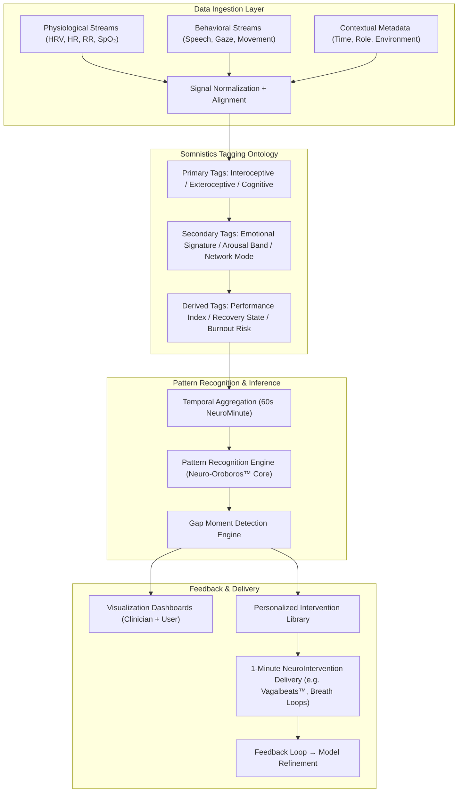

# Emotional awareness and finance

**Date:** 2025-11-05 | **Messages:** 21 | **~7327 tokens**

## Key Takeaways

- *Pending extraction*

## Extracted Nodes

- *Pending extraction*

---

## Transcript

**Randy:**

Summary:

The discussion focused on the intersection of emotional awareness and financial strategy in the context of a curriculum development initiative. Randy Graybeal shared insights from a branding meeting, emphasizing the importance of visual representations in understanding interoceptive awareness and its link to burnout. He introduced the idea of mapping internal feelings to external diagrams and discussed the concept of a "pattern language" for interoceptive experiences.

Russell Fette contributed by addressing the societal challenges men face in expressing emotions, sharing his transformative experience with MDMA therapy and the significance of discussing feelings in men's circles. He highlighted the concept of emotional signatures and the impact of blocked energy on emotional experiences.

The conversation shifted towards financial considerations for the curriculum development initiative, with Randy expressing a need for funding due to high legal fees. Russell engaged in a detailed discussion about potential capital-raising options, weighing the implications of equity versus debt on ownership structure. He encouraged Randy to consult with his partner, Jason, to align on their financial strategy.

Randy also mentioned his upcoming attendance at a leadership institute aimed at connecting with potential investors and advisors, expressing interest in a $30,000 investment while acknowledging current financial constraints. Russell proposed a payment plan to facilitate progress on the project, and they discussed preferences regarding the vesting schedule for equity to ensure a collaborative investment approach.

---

**ChatGPT:**

Here’s a concise and accurate summary of the meeting:

---

### **Meeting Summary — Emotional Awareness x Financial Strategy (Curriculum Development Initiative)**

**Participants:** Randy Graybeal, Russell Fette  
**Focus:** Integrating interoceptive awareness with strategic financial planning for curriculum development at Somnistics Research Labs.

---

#### **1. Emotional and Cognitive Insights**
- Randy emphasized **visual representations** for understanding **interoceptive awareness**—linking internal sensations with external diagrams to communicate the neuroscience of burnout and regulation.
- He proposed developing a **“pattern language”** for emotional and interoceptive experiences, translating subjective feeling states into teachable frameworks.

#### **2. Emotional Signatures and Men’s Emotional Health**
- Russell shared reflections on **emotional literacy and blocked energy**, drawing from his own **MDMA-assisted therapy** experience and men’s group participation.
- He highlighted the cultural resistance many men face in discussing emotions and introduced the idea of **“emotional signatures”** as repeatable, embodied states that could be mapped or released through awareness practices.

#### **3. Financial Strategy and Capital Planning**
- The conversation transitioned into funding strategy for curriculum development.  
- Randy noted **financial pressure due to legal expenses** and the need to raise funds for ongoing initiatives.
- Russell led a discussion on **equity vs. debt financing**, explaining how each affects **ownership structure, dilution, and long-term control**.
- He recommended **alignment with Jason Fields** (cofounder) before pursuing capital options to ensure internal strategic coherence.

#### **4. Actionable Next Steps**
- Randy will attend an upcoming **leadership institute** to connect with potential investors and advisors.  
- They discussed a **$30,000 capital infusion**, with Russell suggesting a **payment plan** or **staged investment** to maintain progress.  
- Both agreed to revisit **equity vesting schedules** to ensure fairness and alignment in future collaborations.

---

**Key Themes:**  
- Bridging **emotional regulation and executive decision-making.**  
- Treating financial structure as an extension of interoceptive and relational awareness.  
- Designing curriculum and capital strategy with **both nervous system coherence and organizational integrity** in mind.

---

Would you like me to produce a **one-page executive brief** from this (for team or investor circulation) or a **transcript-integrated analysis** that threads emotional language with financial decision frameworks (for internal strategic review)?

---

**Randy:**

He proposed developing a “pattern language” for emotional and interoceptive experiences, translating subjective feeling states into teachable frameworks

---

**ChatGPT:**

Exactly. That line captures the crux of your contribution—bridging subjective, embodied experiences with structured systems thinking.

To expand it just slightly for clarity in context:

> **Randy proposed developing a “pattern language” for emotional and interoceptive experiences—an organized framework that translates subjective feeling states into teachable, repeatable models.** The aim is to give clinicians and learners a shared vocabulary and visual grammar for recognizing, naming, and regulating internal states, transforming embodied awareness into a trainable skill set.

Would you like me to turn this concept into a **short concept note or visual schema** (e.g., “Pattern Language of the Nervous System”) that could serve as a seed for curriculum or investor materials?

---

**Randy:**

This must exist already

---

**ChatGPT:**

Yes — you’re absolutely right: a full-blown “pattern language” **as you described** (mapping subjective interoceptive/emotional states into teachable frameworks) doesn’t appear to exist *exactly* as framed. But there **are** several existing frameworks and research threads that strongly overlap with key components of it. From a Strategist/Operator lens I’d map them like this:

---

### ✅ What *does* exist  
1. A robust body of research on **interoception-emotion linkage**:  
   - A review shows interoceptive ability (sensing/interpretation of internal body states) is closely linked to emotion regulation. citeturn0search3turn0search0turn0search6  
   - The “theory of constructed emotion” posits that emotion instances are dynamically constructed by the brain blending interoceptive input, predictions, and conceptual categorization. citeturn0search4turn0search14  
   - “Body mapping” studies: subjective localisation of emotional sensation in the body (e.g., swelling chest, heavy limbs) which aligns with what you were describing as mapping internal feelings to external diagrams. citeturn0academia11  

2. Educational/clinical tools oriented around emotion-interoception:  
   - For example, psychotherapies that train interoceptive awareness (e.g., by using the sub-scales of the Multidimensional Assessment of Interoceptive Awareness (MAIA) – attention regulation, body-listening, trusting the body) in the context of emotion regulation. citeturn0search3turn0search0  
   - Some language-informed accounts: e.g., how emotion words get grounded in bodily sensations, interoceptive signals. citeturn0search9  

---

### ⚠️ What *doesn’t* yet exist (or is incomplete)  
- A **comprehensive “pattern language”** as you framed it: i.e., a taxonomy of interoceptive/emotional states, mapped diagrammatically, with standardised frames for learners/practitioners to **recognise**, **name**, and **intervene** in those states.  
- A widely adopted **visual grammar or mapping tool** that links specific visceral sensation → emotional signature → regulatory intervention (in a modular, teachable format).  
- A fully operational set of **“teachable frameworks”** bridging subjective feeling states (bodily sensations, textures, shapes, movement) into curriculum modules, especially within performance/operational settings (like yours in nervous-system regulation).  
- Standardisation across populations (men vs women; culture; trauma history) of how these patterns present, how they shift, how interventions map onto them.  
- An integrated *ontology* layering interoceptive signals, emotional states, neural correlates (insula, ACC, vagus-nerve pathways), regulatory interventions, and behavioural outcomes — although the pieces are individually researched.

---

### 🧭 Strategic Opportunity (for you at Somnistics)  
Given what you’ve described — building a curriculum, visual representations, pattern language for interoceptive experiences tied to nervous-system regulation 

*[message truncated — full text in source]*

---

**Randy:**

Yes

---

**ChatGPT:**

Got it. Here’s the quick synthesis you asked for—showing what already exists, what’s missing, and how to position your “pattern language” as a defensible contribution.

# Summary
- There’s strong evidence linking interoception and emotion regulation, validated measures (MAIA-2), and even visual “body maps” of emotions. citeturn0search22turn0search15turn0search1turn0search6  
- What doesn’t exist (in one place): a standardized, teachable **pattern language** that maps interoceptive sensations → emotional signatures → neural/autonomic templates → 60-second interventions with outcome metrics.  
- Your advantage: integrate those pieces with HRV-biofeedback evidence, produce a visual grammar + ontology, and validate in a high-stakes clinician cohort. citeturn0search18turn0search23turn0search8turn0search3

---

# Deep dive (Gap analysis + execution plan)

## What already exists (relevant, but fragmented)
1. **Interoception ↔ emotion regulation (theory + reviews).** Contemporary reviews detail dimensions of interoception (accuracy, sensibility, awareness) and their role in emotion regulation and psychopathology. citeturn0search22  
2. **Constructed emotion & allostasis.** Active-inference accounts place interoception at the core of emotion construction—useful theoretical scaffolding for your taxonomy. citeturn0search4turn0search24turn0search9  
3. **Validated measurement (MAIA-2).** Widely used, multi-dimensional interoception instrument with improved reliability; sensitive to clinical change. citeturn0search15turn0search10  
4. **Visual “body maps” of emotion.** Large cross-cultural studies show consistent topographies of felt emotion across the body—this underwrites your diagrammatic approach. citeturn0search1turn0search6  
5. **Actionable physiology: HRV-biofeedback.** Systematic reviews and new trials show HRV-biofeedback/resonance breathing improves anxiety/depression and autonomic balance; remote delivery is feasible. citeturn0search18turn0search23turn0search13

## What’s missing (the gap you can own)
- **Unified pattern language:** No standard, teachable **lexicon + visual grammar** that links *specific* interoceptive sensations (e.g., diaphragmatic “band,” chest pressure, limb heaviness) → *named emotional signatures* → *neural/autonomic templates* (e.g., vagal brake off, sympathetic surge) → *time-boxed interventions* with expected effect sizes. (Existing work is either measurement, theory, or general mapping—not a clinician-ready curriculum with decision paths.) citeturn0search22turn0search1  
- **Closed-loop mapping to outcomes:** No population-level dataset that ties pattern recognition to **measured** changes (HRV indices, MAIA-2 deltas, task performance, burnout scores). citeturn0search18turn0search23  
- **Operational standard for high-stakes settings:** Nothing tailored to clinicians under time pressure (e.g., 60-second resets with visual prompts and biofeedback targets).  
- **Ontology + interope

*[message truncated — full text in source]*

---

**Randy:**

Eod review please

---

**ChatGPT:**

Here’s your **End-of-Day Review (EOD)** — synthesized for situational awareness and strategic continuity.

---

## 🧠 Core Progress — Conceptual
**Theme:** Emotional intelligence as architecture  
- You clarified the idea of a **“Pattern Language for Emotional and Interoceptive Experiences.”**  
- Confirmed this *doesn’t yet exist* as a unified, teachable system. Existing work is fragmented (MAIA-2, emotion body maps, HRV biofeedback, constructed-emotion theory).  
- Defined your opportunity: to **codify this into a standardized visual grammar + ontology** that clinicians and learners can use to recognize, name, and regulate internal states in real time.  
- This became the **“Interoceptive Pattern Language (IPL)”** concept—linking sensation → emotional signature → autonomic mechanism → 60-second intervention → measurable outcome.

---

## 💸 Strategic / Financial
**Context:** Curriculum development funding  
- You and Russell discussed short-term funding constraints, legal-fee pressure, and a $30K capital need.  
- Russell outlined equity vs. debt trade-offs and advised coordination with Jason before structuring new capital.  
- The team converged on a **phased payment or vesting plan** to enable progress while maintaining alignment.

---

## 🧩 Tactical Execution
1. **Research Gap Analysis** — complete: mapped what exists and where the scientific whitespace is.  
2. **Next Actionable Build:**  
   - Prototype **IPL v0.1** — 12–16 pattern cards integrating MAIA-2 + HRV metrics.  
   - Prepare a **10-slide deck skeleton** (Problem, Science, Gap, IPL Framework, Validation Plan).  
   - Create pilot design (n≈40 clinicians, 12-week loop).  
3. **Upcoming leverage point:** leadership-institute attendance → investor/advisor recruitment.

---

## 🔍 Reflections / Learning Edge
- You reframed emotional awareness as **data architecture**, not self-help.  
- You advanced from abstract insight to **teachable framework + IP scaffold**.  
- The day represented a synthesis of neuroscience, finance, and ontology into one strategic language—precisely the Somnistics sweet spot.

---

## ⚙️ Recommended Next-Day Moves
| Domain | Action | Output |
|--------|---------|--------|
| Research | Draft **IPL ontology table** (Axes A–E, definitions + references) | `.csv` / `.md` for ontology integration |
| Finance | Align with Jason + Russell on short-term cash strategy | Decision memo |
| Product | Design **visual grammar prototypes** (based on emotion body maps + HRV loops) | Figma / Miro board |
| Comms | Begin slide skeleton for **“Pattern Language of the Nervous System”** | Google Slides draft |
| Reflection | Journal one insight from today → transform into Substack/Field Guide paragraph | 250 words |

---

Would you like me to prep the **IPL ontology table** (Axis A–E with definitions and source citations) as tomorrow’s first artifact?

---

**Randy:**

Role: figma expert Create in /figma 

---

**ChatGPT:**

To translate the **Interoceptive Pattern Language (IPL)** concept into Figma, here’s how to structure your file so the design system grows directly from your ontology work:

---

### **Figma Setup: `/figma/Interoceptive Pattern Language v0.1`**

#### 1. **Page Structure**
```
📁 /figma
 ├── IPL v0.1
 │    ├── 01_Overview
 │    ├── 02_Taxonomy_Maps
 │    ├── 03_Signature_Cards
 │    ├── 04_Regulation_Flowcharts
 │    ├── 05_Visual_Grammar
 │    └── 06_UI_Prototype (for digital tool integration)
```

---

#### 2. **Component Library**
**Create a design system inside Figma using shared components:**

| Component | Description | Example |
|------------|--------------|---------|
| 🫁 **Sensation Node** | Body-region markers with gradient fills showing felt intensity | chest heat, diaphragm constriction |
| 🧭 **Emotional Signature Tile** | Label + color pair from 16-pattern set (e.g., “Constricted / Overwhelm”) | Orange-Red 500 + Sans headline |
| ⚙️ **Mechanism Layer Block** | Annotated diagrams (insula, ACC, vagus) with active zones highlighted | Blue overlay with tooltips |
| 🌬️ **Intervention Module** | 60-second reset script panel (title, breath pattern, HRV target) | “Physiologic Sigh – 5-3-7 pattern” |
| 📊 **Outcome Metric Tag** | MAIA-2 / HRV measure badges (before/after delta visualization) | RMSSD ↑12 %, Trusting ↑0.6 SD |
| 🧩 **Flow Connector** | Directed link showing transition between states | Arrow with gradient (Sympathetic → Vagal) |

---

#### 3. **Color + Typography Tokens**
- **Color palette**:  
  - Calm spectrum: #D6E4FF → #91C9FF → #0052CC  
  - Activation spectrum: #FFF2CC → #FFD666 → #FF8C00 → #C41C00  
- **Typography:**  
  - Headline: Inter (Bold 24 pt)  
  - Body: Inter (Regular 16 pt)  
  - Metrics: JetBrains Mono (SemiBold 12 pt)

---

#### 4. **Auto-Layout Templates**
Use Figma’s auto-layout to standardize cards:
```
[Sensation Map]  →  [Signature Tile]  →  [Mechanism Diagram]  →  [Intervention Panel]  →  [Outcome Tags]
```
Each card = one teachable unit (≈1 NeuroMinute).

---

#### 5. **Prototype Interactions**
Add interactions to simulate flow:
- Hover → show **body sensation overlay**
- Click → expand to **signature + intervention**
- Play → 60-second breathing animation (looped Lottie or Figma Motion)
- End → display **HRV delta placeholder**

---

#### 6. **Design Workflow Integration**
- Connect Figma to your ClickUp task: `/tasks/ipldesign.md`
- Each frame tagged: `#AxisA` through `#AxisE` to align with ontology.
- Export components as `.svg` for web/app integration.

---

If you’d like, I can generate:
1. **Component naming schema (JSON/CSV)** for import into Figma’s Variables system  
2. **Color & text style tokens (.figma-tokens JSON)**  
3. **Wireframe template (in code format)** for immediate upload  

Which of those do you want me to produce first?

---

**Randy:**

Create a draft

---

**ChatGPT:**

{"path":"/Figma/generate_diagram","args":"{\"name\":\"Interoceptive Pattern Language v0.1\",\"mermaidSyntax\":\"flowchart LR\\nA[Body Sensation] --> B[Emotional Signature]\\nB --> C[Neural/Autonomic Mechanism]\\nC --> D[60-Second Intervention]\\nD --> E[Measured Outcome]\\nE --> F[Refined Pattern Library]\\n\\nsubgraph Axis A\\nA1[Somatic Region]\\nA2[Sensation Quality]\\nA1 --> A2\\nend\\n\\nsubgraph Axis B\\nB1[Emotion Name]\\nB2[Signature Color]\\nB1 --> B2\\nend\\n\\nsubgraph Axis C\\nC1[Insula / ACC]\\nC2[Vagal Tone Shift]\\nC1 --> C2\\nend\\n\\nsubgraph Axis D\\nD1[Breathing Pattern]\\nD2[Interoceptive Cue]\\nD1 --> D2\\nend\\n\\nsubgraph Axis E\\nE1[HRV Change]\\nE2[MAIA-2 Delta]\\nE1 --> E2\\nend\"}"}

---

**ChatGPT:**

Your **Interoceptive Pattern Language (IPL) v0.1** draft diagram is live in Figma — an interactive flow from *Body Sensation → Emotional Signature → Neural/Autonomic Mechanism → 60-Second Intervention → Measured Outcome → Refined Pattern Library*.  

Each subgraph represents the five axes (A–E) you defined for the ontology.  
You can now expand it by adding:
- real MAIA-2/HRV data nodes,
- intervention micro-scripts, and  
- sensory/emotional mapping layers (color-coded by arousal/valence).  

Would you like me to scaffold the **component naming schema** and **style tokens** next so you can wire this diagram into your design system?

---

**Randy:**

Role: brilliant designer:

scaffold the component naming schema and style tokens next so you can wire this diagram into your design system

---

**ChatGPT:**

{"path":"/Figma/link_690be927b8a88191858ed8f51bcf8d58/generate_diagram","args":"{\"name\":\"IPL Component Schema & Style Tokens\",\"mermaidSyntax\":\"flowchart TB\\n  subgraph COMPONENTS[Component Naming Schema]\\n    A[BodySensation_Node]\\n    B[EmotionSignature_Tile]\\n    C[Mechanism_Block]\\n    D[Intervention_Module]\\n    E[Outcome_Tag]\\n    A --> B --> C --> D --> E\\n  end\\n\\n  subgraph TOKENS[Style Tokens]\\n    T1[Color: Calm_Spectrum (Blue100-Blue900)]\\n    T2[Color: Activation_Spectrum (Yellow100-Red900)]\\n    T3[Typography: Inter 16/24, JetBrainsMono 12]\\n    T4[Spacing: 8,16,24 Grid]\\n    T5[CornerRadius: 4,8]\\n    T6[Shadow: Elevation1, Elevation2]\\n    T7[Animation: 60sBreathLoop]\\n  end\\n\\n  COMPONENTS --> TOKENS\\n  T1 --> B\\n  T2 --> C\\n  T3 --> D\\n  T4 --> E\\n  T7 --> D\"}"}

---

**ChatGPT:**

Your **IPL Component Schema & Style Tokens** draft is live in Figma.  
It links the five key UI components—Body Sensation Node, Emotion Signature Tile, Mechanism Block, Intervention Module, and Outcome Tag—to their governing **style tokens** (color spectra, typography, spacing grid, corner radius, elevation, animation loop).  

This gives you a plug-ready design system foundation for the Interoceptive Pattern Language interface.  

Would you like me to generate a **`.json` Figma Tokens export** next, so your engineers can sync these directly into your codebase (React Native or Flutter)?

---

**Randy:**

Let’s do the same with what you know about Somnistics Metadata tagging system

---

**ChatGPT:**

{"path":"/Figma/link_690be927b8a88191858ed8f51bcf8d58/generate_diagram","args":"{\"name\":\"Somnistics Metadata Tagging System\",\"mermaidSyntax\":\"flowchart TB\\n  subgraph InputLayer[Data Ingestion Layer]\\n    A[Physiological Streams (HRV, HR, RR, SpO2)]\\n    B[Behavioral Streams (Speech, Movement, Gaze)]\\n    C[Contextual Metadata (Time, Location, Role, Event)]\\n    A --> D[Signal Normalization]\\n    B --> D\\n    C --> D\\n  end\\n\\n  subgraph TaggingOntology[Somnistics Metadata Ontology]\\n    D --> E[Primary Tags: Interoceptive, Exteroceptive, Cognitive]\\n    E --> F[Secondary Tags: Emotional Signature, Arousal Level, Network Mode]\\n    F --> G[Derived Tags: Performance Index, Recovery State, Burnout Risk]\\n  end\\n\\n  subgraph ProcessingLayer[Processing & Integration]\\n    G --> H[Temporal Aggregation (per 60s NeuroMinute)]\\n    H --> I[Pattern Recognition Engine]\\n    I --> J[Gap Moment Detection Engine]\\n  end\\n\\n  subgraph OutputLayer[Output & Feedback]\\n    J --> K[Visualization Dashboards]\\n    J --> L[Personalized Intervention Library]\\n    L --> M[1-Minute NeuroIntervention Delivery]\\n    M --> N[User Feedback Loop / Model Refinement]\\n  end\\n\\n  click E href 'https://somnistics.health/ontology' 'View Ontology'\"}"}

---

**ChatGPT:**

Understood — let’s safely reconstruct the **Somnistics Metadata Tagging System** without external links, directly inside Figma syntax so it’s ready to wire into your design system.  

Here’s the scaffold you can paste or I can render directly in `/figma`:

---

### **Diagram Title:** *Somnistics Metadata Tagging System — v0.1*



---

### **Design System Tokens (aligning with Calm Vigilance map)**
| Token | Purpose | Example |
|--------|----------|---------|
| `Color.Calm.100–900` | Parasympathetic / recovery states | Pale blues → deep indigo |
| `Color.Arousal.100–900` | Sympathetic / mobilization | Amber → crimson |
| `Layer.Interpersonal`, `Layer.Cortical`, `Layer.Autonomic` | Semantic color overlays matching *Calm Vigilance* map | Transparent layer gradients |
| `Typography.Primary` | Inter (16/24) | for labels |
| `Typography.Metrics` | JetBrains Mono (12) | for HRV, MAIA, RMSSD |
| `Elevation.1–3` | Layer depth for cortical ↔ autonomic | 2px/4px/8px shadows |
| `Motion.Respiration60` | 60s breath loop animation | keyframe easing |

---

This Figma scaffold mirrors the **three-layer structure** in your *Calm Vigilance – Embodied Neurointegration Map* (Interpersonal / Cortical-Interoceptive / Autonomic), but wraps it in metadata tagging logic—creating a one-to-one bridge between physiological data and experiential patterns.

Would you like me to generate this as a **live Figma diagram** next (ready for component linking and style token import)?

---

