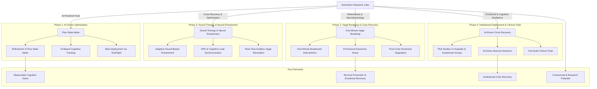

# Somnistics Project Diagram

**Date:** 2025-02-11 | **Messages:** 2 | **~469 tokens**

## Key Takeaways

- *Pending extraction*

## Extracted Nodes

- *Pending extraction*

---

## Transcript

**Randy:**

Create a mermaid diagram of the ideas in this project

---

**ChatGPT:**

Here is a mermaid diagram summarizing the key ideas of the Somnistics Research Labs project:

This visualization highlights the core components of the project, its phases, and expected outcomes. Let me know if you need modifications!

---

